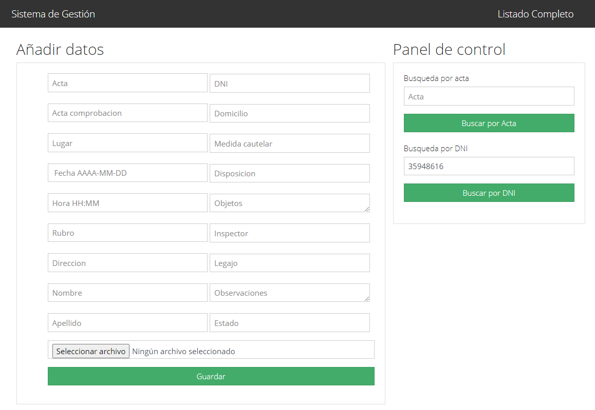

# Descripción

El sistema CRUD (Crete-Read-Update-Delete) sobre una tabla SQL dada, está implementado en PHP+JS+MYSQL
Descripción de algunos archivos:

1) Index.php: Contiene la vista principal. Basicamente consiste en una tabla de 5 registros, donde se muestran las últimas entradas de la tabla
en orden de creación. La tabla no se muestra completa, sino algunos de sus atributos principales.
Tambien en el index se encuentra el panel para agregar datos a la tabla, y también un buscador, donde la busqueda se realiza por numero de acta.
En la tabla, tenemos acceso a la funciones principales sobre cada elemento:
    Editar: Edita el texto contenido en el acta
    Eliminar: Elimina tanto el acta de la base de datos, como la imagen adjunta del acta en el directorio local
    Abrir Acta: Nos abre una imagen tamaño completo del acta seleccionada
    Abrir ficha completa: Nos muestra todos los campos del acta completos

2) Open_task.php: Este archivo se encarga de llevarnos a una pantalla donde se muestra la imagen del acta adjuntada en tamaño completo. Esta pantalla es ideal
para imprimirlas con CTRL+P

3) Search_task.php: Este archivo nos renderiza la tabla cuyo numero de acta es ingresado en la busqueda, desde el index. Esta busqueda nos permite tambien eliminar, editar y ver los datos,
pero solo del acta buscada por parametro

4)full_task.php: Este archivo nos muestra la tabla completa, con todos sus campos. Se accede desde el index

